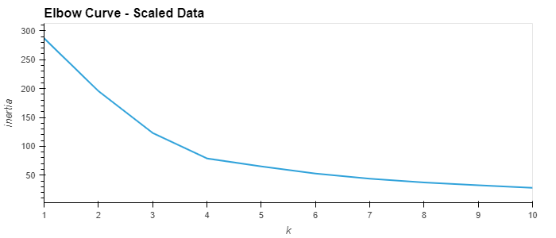
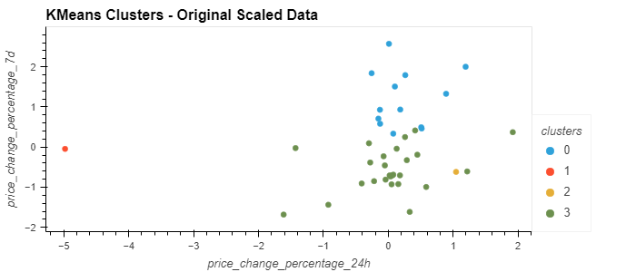
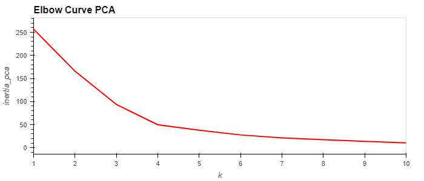
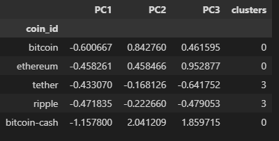
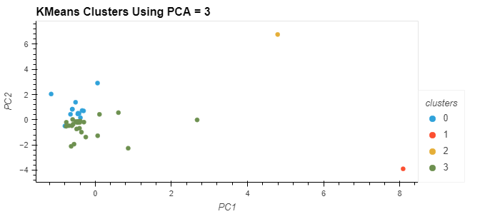

# CryptoClustering
## **Module 19 Challenge CryptoClustering for UCI Data Analytics Bootcamp**

## Vincent Passanisi

## Due March 8, 2023

---

# **Introduction**

This challenge assignment required us to use an unsupervised learning model to predict if cryptocurrencies are affected by 24-hour or 7-day price changes. Data was prepared using the StadardScaler function, and then the best value for 'k' was determined using the original scaled data. Clusters were then plotted using the results.

Clusters were then optimized using Principal Cluster Analysis (PCA). 'k' was plotted using the PCA data to determine the best number of clusters to use, and then clusters were plotted using this information.

Finally all charts were displayed side-by-side to determine best approach.
  
# **Files**

In the repository are the completed challenge files.

* *README.md* - ReadMe file for the project.
* *Crypto_Clustering_final* - completed Jupyter notebook.
* *Crypto_Clustering_starter* - provided Jupyter notebook with starter code.
* *Resources* folder - contain the cryto_market_data.csv with starter data
* *images* folder - contains images used in the README file.
  

# **Results**

The original scaled data when plotted using 'k' showed a best fit of four clusters.

  
Even so, some of the clusters overlapped in such a way that it could be determined this was a poor fit. 

  
Clusters were created using PCA and total explained variance was calculated to be 89.5% for the three components. This number predicts that PCA will probably be a better predictor than the standard model which included many more features. Plotting 'k' for the PCA data displayed a lower inertia overall, and also showed that four clusters would be optimal.

  
A dataframe was created using the PCA data.

  
And finally, the clusters were plotted.

  
Clustering using PCA shows a much clearer distinction between groups which would result in a better model prediction for unsupervised learning.
  

# **Comments and Thoughts**

After spending almost three weeks on the previous challenge assignment, this assignment seemed far less complex and less time-consuming. The bulk of the notebook was completed in a few hours. Commenting and creation of my README took a larger percentage of my work time than it had for other assignments. Perhaps it was partly due to my increasing comfort level in working with Python and Jupyter notebooks. Frankly, much of this assignment could be completed just using boiler-plate code. There was far less need for creative solutions. The process was straightforward and methodical. I will also confess that it was nice getting a little breather. This assignment allowed me to catch up a bit on my course work where I was starting to slowly fall behind. 

